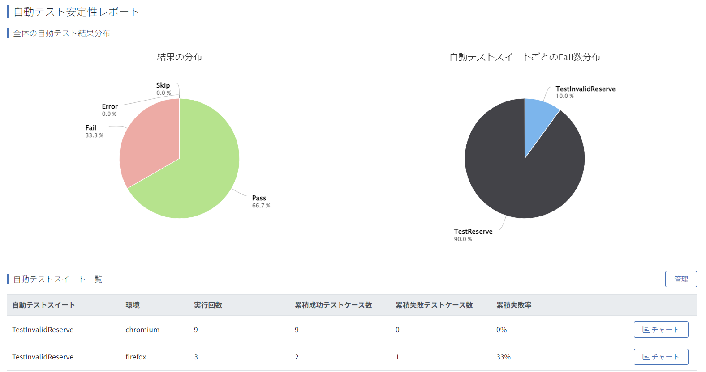

# 自動テスト安定性レポート連携アクション

自動テスト結果をQualityForwardの自動テスト安定性レポートに連携します。



## 入力情報

### `api_key`

**必須項目** Quality ForwardのプロジェクトAPIキーを設定してください。<br>必ず、[GitHub Actions でのシークレットの使用](https://docs.github.com/ja/actions/security-for-github-actions/security-guides/using-secrets-in-github-actions)を利用して、設定してください。<br>APIキーの設定方法はQualityForward APIの[APIキーの発行手順](https://qualityforward.github.io/api-spec/#section/API/API)をご確認ください。

### `file-path`

**必須項目** 自動テストの実行結果を格納したファイルパスを設定してください。ワイルドカードで指定可能です。

### `test-framework`

**必須項目** 使用したテストフレームワークを設定してください。

設定できるテストフレームワーク

|テストフレームワーク|ファイル拡張子|
|:--:|:--:|
|junit|xml|
|pytest|xml|
|nodejs-playwright|xml|
|pytest-playwright|xml|
|magicpod|json|

※ 上記以外のテストフレームワークでも、junit-xml形式のファイルで出力できるものは**junit**を設定してください

### `auto_test_suite_external_key`

連携する自動テストスイート名を設定してください。

設定しない場合の自動テストスイート名

|テストフレームワーク|自動テストスイート名|
|:--:|:--|
|junit,nodejs-playwright|testsuite要素のname属性|
|pytest,pytest-playwright|testcase要素のclassname属性<br>最後のドット以降を取得<br>（例）test.testSuiteの場合、”testSuite”を取得|
|magicpod|テスト一括実行設定名|

### `auto_test_cycle_name`

連携する自動テストサイクル名を設定してください。

設定しない場合の自動テストサイクル名

|テストフレームワーク|自動テストサイクル名|例|
|:--:|:--|:--|
|junit|アクション実行日時|9/26/2024, 4:10:10 AM|
|pytest,nodejs-playwright,pytest-playwright|testsuite要素のtimestamp属性|2024-08-28T15:12:57.311996+09:00|
|magicpod|テスト一括実行終了日時|2024-05-09T02:44:32Z|

### `auto_execution_device_external_key`

連携する自動テスト実施環境名を設定してください。

設定しない場合の自動テスト実施環境名

|テストフレームワーク|自動テスト実施環境名|
|:--:|:--|
|junit,pytest,magicpod|標準環境|
|nodejs-playwright|testsuite要素のhostname属性|
|pytest-playwright|testcase要素のname属性から取得<br>（例）test_sample[chromium-data-driven]の場合、”chromium”を取得|

## 活用例

### 特定ファイルを指定する場合

```yaml
steps:
  - name: Checkout repository
    uses: actions/checkout@v4 

  - name: Run tests
    run: pytest tests/ --junitxml=result.xml 

  - name: link Automated Test Results
    uses: QualityForward/test-stability-report-sync@v1.1.0
    with:
      file-path: result.xml
      test-framework: pytest-playwright
      api-key: ${{ secrets.API_KEY }}
      auto_test_suite_external_key: testSuites
      auto_test_cycle_name: testCycleName
      auto_execution_device_external_key: sampleDevice
```

### 特定のフォルダに格納されているファイルをすべて連携する場合

※同じテストフレームワークに限ります

```yaml
steps:
  - name: Checkout repository
    uses: actions/checkout@v4 

  - name: Run tests
    run: pytest tests/ --junitxml=result.xml 

  - name: link Automated Test Results
    uses: QualityForward/test-stability-report-sync@v1.1.0
    with:
      file-path: results/*.xml
      test-framework: junit
      api-key: ${{ secrets.API_KEY }}
      auto_execution_device_external_key: chrome
```
